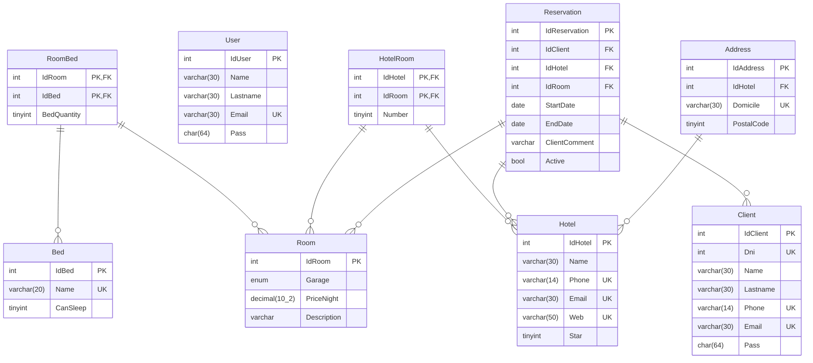

```mermaid

erDiagram

Reservation{
    int IdReservation PK
    int IdClient FK
    int IdHotel FK
    int IdRoom FK
    date StartDate
    date EndDate
    varchar ClientComment
    bool Active
}

User{
    int IdUser PK
    varchar(30) Name 
    varchar(30) Lastname 
    varchar(30) Email UK
    char(64) Pass
}

Bed{
    int IdBed PK
    varchar(20) Name UK
    tinyint CanSleep
}

Room{
    int IdRoom PK
    enum Garage
    decimal(10_2) PriceNight
    varchar Description
}

Client{
    int IdClient PK
    int Dni UK
    varchar(30) Name
    varchar(30) Lastname
    varchar(14) Phone UK
    varchar(30) Email UK
    char(64) Pass
}

Hotel{
    int IdHotel PK
    varchar(30) Name
    varchar(14) Phone UK
    varchar(30) Email UK
    varchar(50) Web UK
    tinyint Star
}

RoomBed{
    int IdRoom PK,FK
    int IdBed PK,FK
    tinyint BedQuantity
}

Address{
    int IdAddress PK
    int IdHotel FK
    varchar(30) Domicile UK
    tinyint PostalCode 
}

HotelRoom{
    int IdHotel PK, FK
    int IdRoom PK, FK
    tinyint Number
}

RoomBed ||--o{ Bed: ""
RoomBed ||--o{ Room : ""
HotelRoom ||--o{ Hotel : ""
HotelRoom ||--o{ Room : ""
Reservation ||--o{ Room : ""
Reservation ||--o{ Hotel : ""
Reservation ||--o{ Client : ""
Address ||--o{ Hotel : ""

```