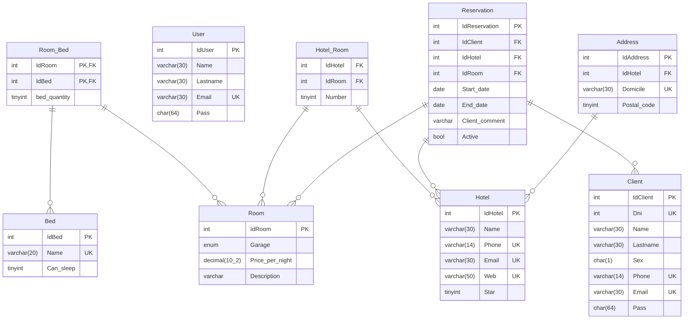

```mermaid

erDiagram

Reservation{
    int IdReservation PK
    int IdClient FK
    int IdHotel FK
    int IdRoom FK
    date Start_date
    date End_date
    varchar Client_comment
    bool Active
}

User{
    int IdUser PK
    varchar(30) Name 
    varchar(30) Lastname 
    varchar(30) Email UK
    char(64) Pass
}

Bed{
    int IdBed PK
    varchar(20) Name UK
    tinyint Can_sleep
}

Room{
    int IdRoom PK
    enum Garage
    decimal(10_2) Price_per_night
    varchar Description
}

Client{
    int IdClient PK
    int Dni UK
    varchar(30) Name
    varchar(30) Lastname
    char(1) Sex
    varchar(14) Phone UK
    varchar(30) Email UK
    char(64) Pass
}

Hotel{
    int IdHotel PK
    varchar(30) Name
    varchar(14) Phone UK
    varchar(30) Email UK
    varchar(50) Web UK
    tinyint Star
}

Room_Bed{
    int IdRoom PK,FK
    int IdBed PK,FK
    tinyint bed_quantity
}

Address{
    int IdAddress PK
    int IdHotel FK
    varchar(30) Domicile UK
    tinyint Postal_code 
}

Hotel_Room{
    int IdHotel FK
    int IdRoom FK
    tinyint Number
}

Room_Bed ||--o{ Bed: ""
Room_Bed ||--o{ Room : ""
Hotel_Room ||--o{ Hotel : ""
Hotel_Room ||--o{ Room : ""
Reservation ||--o{ Room : ""
Reservation ||--o{ Hotel : ""
Reservation ||--o{ Client : ""
Address ||--o{ Hotel : ""

```